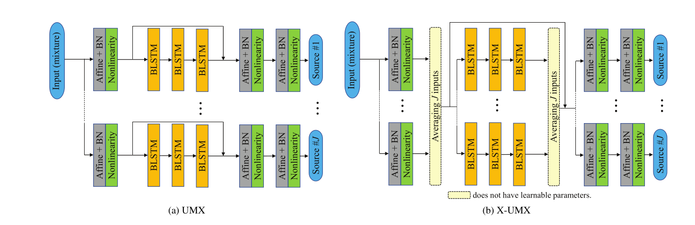
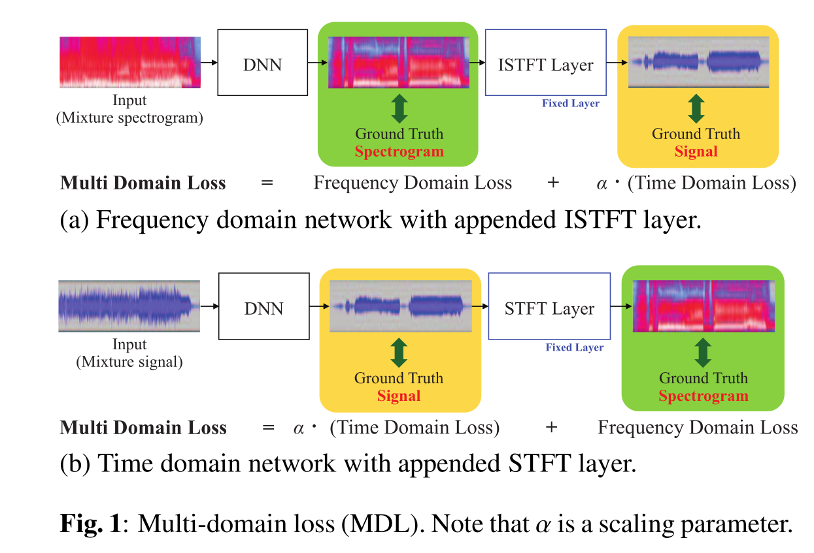
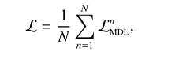

# X-UMX paper summary

* Same basic architecture as UMX 

* FNN + BLSTM  + FNN per source.
* In front/after BLSTM Average input/output
* Loss functions: MDL(Multi-Domain-Loss) and CL (Combination Loss)

## MDL
* Use both, MSE between (Spec <-> Spec_pred) and wSDR between 'estimated and reference time signals' What is that?
* Predict just one domain and transform to other for loss computation 

* Seems to be better then only one domain ...

 
## CL
* Compute MDL for all combinations of signals and average:

* That is 14 combinations for 4 sources
* minimize leakage of sound from one signal to the other
