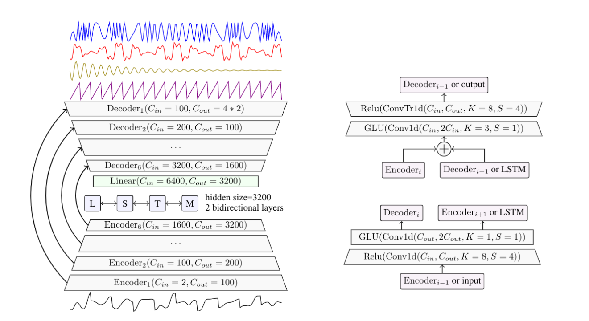

# Demucs 

* works in sequence domain
* basic autoencoder with lstm ? basically yes but actually no
* used 1d convolution  
* adapts speech source seperation model
* works on both channels simultaneously ?!
* uses both, LSTM and GLU

## Interesting citations:

* "An upper bound on the performance of all methods relying on
masking spectrograms is given by the SDR obtained when using a mask computed using the ground
truth sources spectrograms, for instance the Ideal Ratio Mask (IRM) or the Ideal Binary Mask (IBM)
oracles"

* "Demucs is inspired by models for
music synthesis rather than masking approaches."

* "It is a U-net architecture with a convolutional encoder
and a decoder based on wide transposed convolutions with large strides inspired by recent work on
music synthesis"

* "The other critical features of the approach are a bidirectional
LSTM between the encoder and the decoder, increasing the number of channels exponentially with
depth, gated linear units as activation function"

* "The original Conv-Tasnet was trained using a loss
called scale-invariant source-to-noise ratio (SI-SNR), similar to the SDR loss described in Section 5.
We instead use a simple L1 loss between the estimated and ground truth sources."

* "As we show in our ablation study 6.2, the usage of GLU activations
after these convolutions significantly boost performance."

* "In terms of training and architecture, we confirm the importance of using pitch/tempo shift augmenta-
tions (although the Conv-Tasnet architecture does not seem to benefit from it), as well as using LSTM
for long range dependencies, and powerful encoding and decoding layers with 1x1 convolutions and
GLU activations."

## Links

comparison of models: https://ai.honu.io/papers/demucs/index.html

github              : https://github.com/facebookresearch/demucs

paper: https://hal.archives-ouvertes.fr/hal-02379796/document

GLU paper: https://arxiv.org/abs/1612.08083
